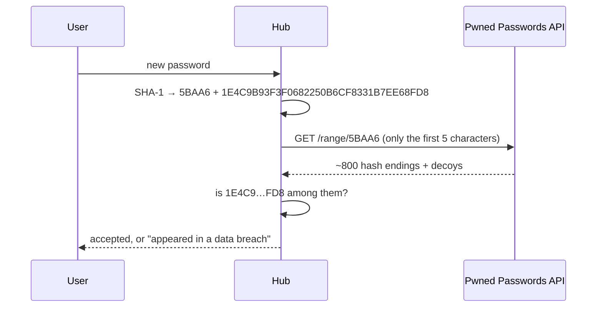

# Secure SSO Hub

A Ruby on Rails application that acts as a central Single Sign-On (SSO) provider: it owns the
user accounts (Devise), authenticates people, and issues signed JWTs that client applications and
services trust. The target architecture — an OAuth 2.1 / OpenID Connect authorization server with an
MCP endpoint for agents — is described in [`docs/ARCHITECTURE.md`](docs/ARCHITECTURE.md); the
current-state audit is in [`docs/AUDIT.md`](docs/AUDIT.md) and the backlog in [`TODO.md`](TODO.md).

## Building blocks

| Concern | Implementation |
|---|---|
| Framework | Rails 8.1, Ruby 3.4.10, PostgreSQL 17 |
| User accounts | [Devise](https://github.com/heartcombo/devise) |
| Identity | each user has a stable `sso_id` (UUID) used as the token subject, decoupled from the email |
| Authorization server | [Doorkeeper](https://github.com/doorkeeper-gem/doorkeeper) + doorkeeper-openid_connect behind `app/services/oauth`; RS256 access tokens via doorkeeper-jwt (`OAuth::TokenPayload`) |
| Token verification on the hub's own API | [`rack-jwt-verifier`](https://rubygems.org/gems/rack-jwt-verifier) |
| Security headers / CSP | [`header_guard`](https://rubygems.org/gems/header_guard) |
| Reference client (tests, docs) | [`omniauth-ssoprovider`](https://rubygems.org/gems/omniauth-ssoprovider) |

## The SSO flow

1. A client application redirects the user to the hub's authorization endpoint.
2. The hub authenticates the user with Devise (and asks for consent).
3. The client exchanges the authorization code for a signed JWT at the token endpoint.
4. The client verifies the token (via the hub's JWKS) and establishes its own session.

The endpoints are being built phase by phase; see `TODO.md` for what exists today.

## Development

```bash
docker compose up -d db redis                # PostgreSQL 17 on localhost:5432, Redis on 127.0.0.1:6379
bundle install
DATABASE_URL=postgres://postgres:<password>@localhost:5432/secure_sso_hub_test \
  bin/rails db:prepare                       # <password> = POSTGRES_PASSWORD from docker-compose.yml
bundle exec rspec
```

Or run everything in containers with `docker compose up --build`.

## Configuration

All configuration comes from environment variables; there are no fallback values for secrets.

| Variable | Purpose |
|---|---|
| `DATABASE_URL` / `SECURE_SSO_HUB_DATABASE_PASSWORD` | database connection |
| `REDIS_URL` | Redis for the shared `Rails.cache` (rate limits, readiness), e.g. `redis://redis:6379/0`; required in production — the hub refuses to boot without it. Development defaults to `redis://localhost:6379/0` (the compose `redis` service); tests use an in-memory store |
| `HUB_ISSUER` | canonical https URL of this hub, e.g. `https://sso.example.com` — the OAuth/OIDC `iss` and the base of every discovery URL; required outside development/test |
| `OIDC_SIGNING_KEY` | active RSA private key (≥ 2048 bits) that signs access and id tokens — PEM, or the PEM base64-encoded on one line; required outside development/test (an ephemeral key is generated there) |
| `OIDC_SIGNING_KEY_PREVIOUS` | the previous signing key during a rotation (same format); stays published in the JWKS so tokens it signed still verify |
| `OAUTH_REFRESH_TOKEN_TTL` | absolute lifetime of a refresh token in seconds, counted from the authorization code it descends from (default 2592000 = 30 days); access tokens live 10 minutes, codes 1 minute |
| `OAUTH_REGISTRATION_POLICY` | dynamic client registration (`POST /oauth/register`, RFC 7591): `approval` (default) — new clients wait for an administrator; `open` — public (PKCE) clients are usable at once; `closed` — no endpoint, not advertised in discovery. Any other value stops the boot |
| `OAUTH_REGISTRATION_IP_LIMIT` | registration attempts per source address and hour (default 20); beyond it `429` — see [Rate limits](#rate-limits) |
| `OAUTH_TOKEN_RATE_LIMIT` | `POST /oauth/token` requests per client and address, per minute (default 300) |
| `OAUTH_REVOKE_RATE_LIMIT` | `POST /oauth/revoke` requests per client and address, per minute (default 60) |
| `OAUTH_INTROSPECT_RATE_LIMIT` | `POST /oauth/introspect` requests per client and address, per minute (default 1200) |
| `SIGN_IN_RATE_LIMIT` | sign-in attempts per address, per minute (default 20) |
| `SIGN_IN_EMAIL_RATE_LIMIT` | sign-in attempts per submitted email, per minute (default 10) |
| `ACCOUNT_MAIL_RATE_LIMIT` | password-reset, unlock and confirmation requests per address, per hour (default 20) |
| `ACCOUNT_MAIL_EMAIL_RATE_LIMIT` | password-reset, unlock and confirmation requests per submitted email, per hour (default 5) |
| `SMTP_ADDRESS` | host of the SMTP server that sends the hub's mail (confirmation, password reset, unlock); required in production — the hub refuses to boot without it. See [Accounts and mail](#accounts-and-mail) |
| `SMTP_PORT` | SMTP port (default 587, STARTTLS); `465` means TLS from the first byte |
| `SMTP_USERNAME` / `SMTP_PASSWORD` | SMTP login, if the server wants one; with a username set, the connection must be encrypted (STARTTLS required) or nothing is sent |
| `MAILER_FROM` | sender of the hub's mail, e.g. `Secure SSO Hub <no-reply@sso.example.com>`; required in production |
| `PASSWORD_BREACH_CHECK` | what happens when the breached-password service cannot be reached: `warn` (default) — accept the password and log a warning; `block` — refuse it until the service answers; `off` — never check (hosts without internet access). Any other value stops the boot |
| `RAILS_MASTER_KEY` | Rails credentials |

### Accounts and mail

**Creating an account.** There is no public sign-up: an administrator creates accounts from a console.
The hub then mails the person a confirmation link, and they cannot sign in until they follow it — that
is what lets every token and userinfo response say `email_verified: true`. A link works for 3 days;
after that, "Didn't receive confirmation instructions?" on the sign-in page sends a new one. Changing
an account's email works the same way: the new address gets a link, and the old one stays in use until
it is confirmed.

```ruby
User.create!(email: "ada@example.com", name: "Ada Lovelace", password: "<12 or more characters>")
# The very first administrator, before mail is set up — no confirmation needed:
User.new(email: "admin@example.com", name: "Admin", password: "<…>", is_admin: true).tap(&:skip_confirmation!).save!
```

**Passwords.** At least 12 characters; length protects better than rules about digits and symbols.
A new password is also refused if it has appeared in a known data breach — attackers try those first.
The hub asks [Have I Been Pwned's Pwned Passwords](https://haveibeenpwned.com/Passwords) (free, no
account) without ever sending the password: it sends only the first 5 characters of the password's
SHA-1 hash, gets back every leaked hash that starts with them (padded with decoys, so even the size of
the answer says nothing), and compares locally.



If the service cannot be reached (3-second timeouts), `PASSWORD_BREACH_CHECK` decides: `warn` keeps
password changes working during an outage and logs it; `block` refuses passwords until the check works
again; `off` is for hosts that never reach the internet. We recommend `warn`.

**Mail.** Any SMTP server works — your provider's, or a local relay — set with the `SMTP_*` variables
and `MAILER_FROM`. Production refuses to boot without a server and a sender, because without mail no
account could be confirmed or recovered; a mail that cannot be delivered fails the request rather than
vanishing. Links in mail point at `HUB_ISSUER`. In development, mail is written to `tmp/mails/<address>`
instead of being sent: open the file and follow the link.

### Dynamic client registration

Clients — MCP agents above all — find `registration_endpoint` in the discovery documents and register
themselves with RFC 7591 metadata (`client_name`, `redirect_uris`, `token_endpoint_auth_method`: `none` for
a public PKCE client, `client_secret_basic`/`client_secret_post` for a confidential one, `scope`, …). A
confidential client receives its `client_secret` once, in the response. Registration never grants
`admin:*` or machine scopes, nor the machine grant; the same `client_name` with the same `redirect_uris`
is refused for 24 hours.

With the default `approval` policy the client is `pending`: it cannot sign anyone in or obtain tokens
until an administrator approves it. Until the admin UI exists (Phase 3), from a console:

```ruby
OAuth::Clients.list(state: :pending)   # review: name, redirect URIs, scopes, contacts, registration_ip
OAuth::Clients.approve("<client_id>", by: User.find_by!(email: "<admin email>"))
OAuth::Clients.revoke("<client_id>", by: User.find_by!(email: "<admin email>"))   # refuse (final)
```

### Rate limits

The token, revocation, introspection and registration endpoints and the sign-in, password-reset,
unlock and confirmation forms are rate limited with Rails' `rate_limit`, counted in the shared cache (Redis, `REDIS_URL`).
Each limit is a positive integer of requests per key and window, set by the variables above; anything
else stops the boot, so a typo cannot lift a limit.

- **OAuth endpoints** count a request that names an approved client per client *and* address, everything
  else (no `client_id`, an unknown or unapproved one) per address. Beyond the limit they answer `429`
  with `{"error": "temporarily_unavailable"}`, `Retry-After` (the window, in seconds) and `no-store`.
- **Account forms** count per address and per submitted email (hashed before it reaches the cache).
  Beyond the limit the form is shown again with `429`, `Retry-After` and a message that says nothing about
  whether the account exists. Failed-attempts lockout still applies on top.

Every attempt counts, accepted or refused. If Redis cannot be reached, nothing is counted and requests
go through: an outage of the cache does not stop sign-in or token issuance. Behind a reverse proxy,
Rails must trust the proxy (`config.action_dispatch.trusted_proxies`, set up with the production
deployment) so the client's address is counted, not the proxy's.

### Key rotation

Every token carries the `kid` (RFC 7638 thumbprint) of the key that signed it; clients and resource
servers verify against `https://<hub>/.well-known/jwks.json`, which lists the active key and, during a
rotation, the previous one.

```bash
bin/rails hub:keys:generate     # prints a new key as OIDC_SIGNING_KEY=<base64 PEM> plus its kid
bin/rails hub:keys:show         # kids of the keys the running app has loaded
```

1. Generate a new key. Set `OIDC_SIGNING_KEY_PREVIOUS` to the *current* value and `OIDC_SIGNING_KEY`
   to the new one; deploy. New tokens are signed with the new key; the JWKS lists both.
2. Wait at least the longest token lifetime (refresh tokens included) plus the clients' JWKS cache
   TTL (5 minutes by default).
3. Remove `OIDC_SIGNING_KEY_PREVIOUS`; deploy. The old key disappears from the JWKS.

## Task workflow

This repository uses the harness plugin: `tasks/` holds the task files, `.harness/rules/` the
rules, and `.harness/progress.md` the log. See `CLAUDE.md`.
